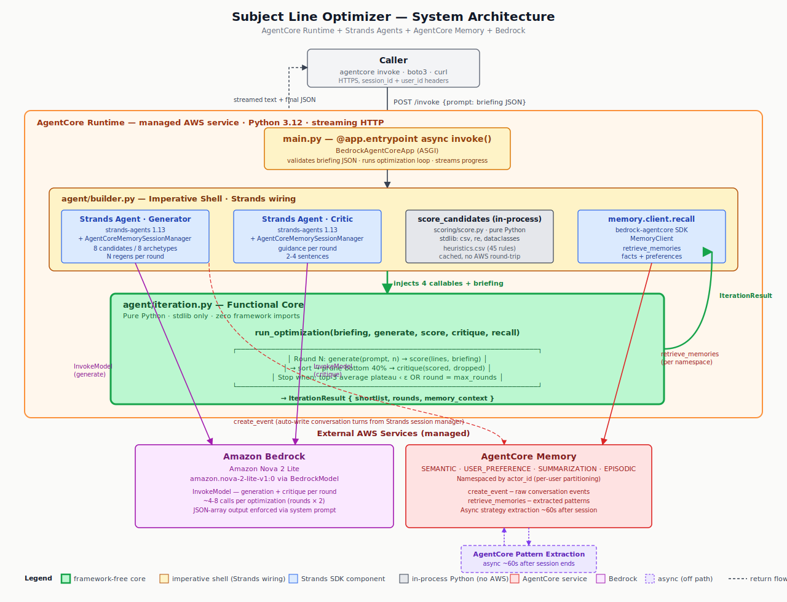
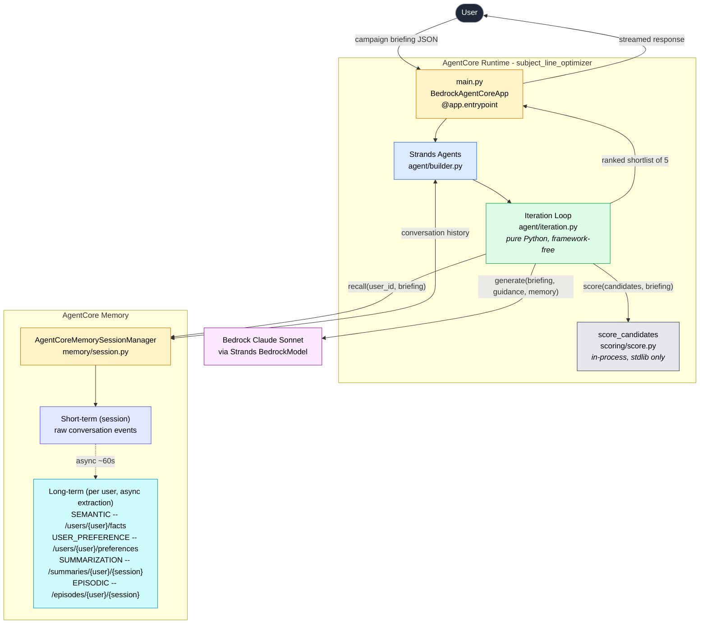
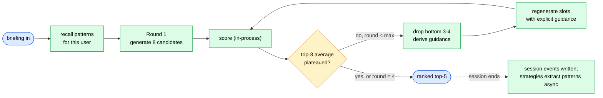
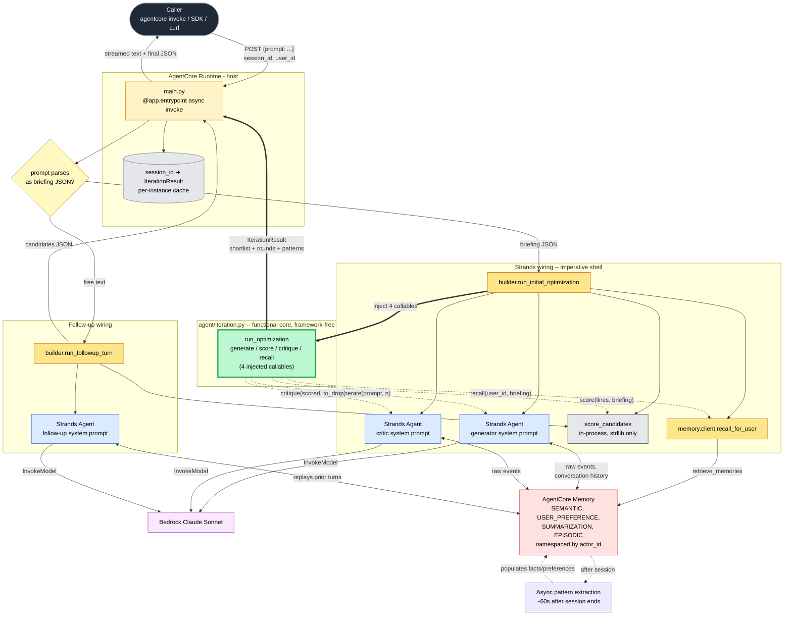

# Architecture

## System diagram



A conventional layered software architecture diagram in [`architecture.svg`](architecture.svg). Each rectangle is a component or managed service labeled with its underlying technology; arrows are directed data flows.

Three tiers, top to bottom:

- **Caller** — any client (the `agentcore` CLI, an SDK call via `boto3`, or raw HTTPS) sending the briefing JSON or follow-up text.
- **AgentCore Runtime (managed AWS service · Python 3.12)** — contains:
  - `main.py` ASGI entrypoint built on `BedrockAgentCoreApp`
  - The imperative shell `agent/builder.py` housing two Strands Agents (Generator, Critic), an in-process `score_candidates` function, the explicit memory recall helper, and a per-instance session cache
  - The framework-free **functional core** at `agent/iteration.py` (highlighted in green with a thick border) — this is the only file in the system that imports zero frameworks
- **External AWS services** — Bedrock (Claude Sonnet 4.5) and AgentCore Memory (four strategies, namespaced by `actor_id`).

Off the request path: the dashed purple "Pattern Extraction" block — AgentCore Memory's asynchronous strategy extraction, running ~60 seconds after the session ends, populating long-term namespaces for the next session.

## What the agent does

A campaign briefing comes in as JSON. The agent generates 8 subject-line candidates, scores them through a transparent in-process heuristic scorer, drops the bottom 3-4, learns *why* they failed, regenerates replacements with explicit guidance, and re-scores. It loops until the top-3 average plateaus or hits 4 rounds. A ranked shortlist of 5 comes back. Patterns about what worked for this user persist across sessions.

## Request flow (single session)



## The iteration loop (the interesting part)



## Local vs deployed

| Layer | `agentcore dev` | `agentcore deploy` |
|---|---|---|
| Runtime | Local ASGI server, hot reload | AgentCore Runtime, CodeZip |
| LLM | Bedrock (real, via AWS creds) | Bedrock (real) |
| Scoring | In-process Python — same code, no AWS round-trip | In-process Python — same code, no AWS round-trip |
| Memory | None (session manager returns `None` when env var unset) | Real Memory, all 4 strategies active |
| Cross-session learning | Disabled | Enabled (~60s extraction lag) |

AWS credentials are required for both modes since the LLM is Bedrock either way. Memory is the only resource with a meaningful local fallback (the Strands session manager simply returns `None`, and the agent runs without persistent learning). Scoring is identical in both modes.

## Why scoring is in-process, not in AgentCore Code Interpreter

This was a deliberate choice and a question worth answering directly, because Code Interpreter would be a natural-looking fit at first glance.

The scorer is ~250 lines of pure Python: read a CSV, run regex matches, sum weighted contributions, return JSON. It has no untrusted input — the LLM produces strings; the scorer feeds them to `re.search`. Its only dependencies are `csv`, `re`, and `dataclasses` from the standard library. It runs in milliseconds.

A managed sandbox carries real cost. Each Code Interpreter session adds spin-up latency, a separate billing line, a separate failure mode, a separate observability surface, and a dependency on a managed service that can have regional outages. Those costs would be load-bearing if the workload genuinely needed isolation. For 250 lines of stdlib regex-and-arithmetic, the cost / benefit doesn't survive a calm production review.

The cases where Code Interpreter *would* be the right answer for a scoring step in this kind of agent:

- **The LLM authors scoring code at runtime.** Real untrusted execution. A sandbox is mandatory.
- **The scorer needs heavyweight dependencies that don't belong in the agent's runtime image** (scikit-learn, pandas, GPU-bound numerics). Dependency isolation becomes the load-bearing argument.
- **The scoring code is ephemeral or user-supplied** (the agent fetches it from S3, accepts it through an API, generates it on the fly). Without a deployment artifact of its own, sandboxed execution is the natural way to run it.

None of those describe this scorer. It's known code, authored by the agent's owner, deployed in the agent's CodeZip artifact alongside `main.py`. Updating it requires the same redeploy cycle as updating any other file in the agent. There is no organizational, security, or operational boundary for Code Interpreter to enforce. The scorer is just code, and code that lives in the same package as the rest of the agent should run in the same process.

The scorer remains structurally a clean module — same `score_subject_line` function, same JSON output shape, same heuristics CSV — so when one of the conditions above eventually becomes true (the article reader calibrates against real send data and adopts scikit-learn; a separate team starts owning scoring with its own deploy cadence; the LLM is given license to author scoring snippets) the migration to Code Interpreter is a small, mechanical change. Until then, in-process is the right place for it.

## End-to-end flowchart

The full picture: caller → entrypoint → framework-coupled wiring → **functional core (framework-free)** → external services. The thick green boundary is the only file that doesn't import Strands, AgentCore, or boto3.



### How to read this diagram

**Solid arrows (`-->`)** are direct calls / data flow. Top-down for requests, bottom-up for responses.

**Dotted arrows (`-.->`)** are dependency-injected callbacks. The loop calls these; it does not import them. They originate inside the imperative shell, get passed into `run_optimization` as function parameters, and the loop invokes them at the right moments.

**Heavy arrows (`==>`)** mark the contract boundary between the imperative shell and the functional core. The loop receives four callables and a briefing, returns an `IterationResult`. That's its entire contract.

**Color coding:**

| Color | Meaning |
|---|---|
| Yellow (orange border) | AgentCore-CLI-managed entrypoint — `main.py` and the per-instance session cache |
| Tan | Imperative shell — file-level glue that imports Strands, AgentCore SDK, `bedrock-agentcore`. The "wires" between core and services |
| Blue | Strands Agent instances — three of them, one per system prompt (generator, critic, follow-up) |
| Gray | In-process Python helpers — no AWS, no framework, no network |
| **Bright green (thick border)** | **The functional core. Imports only `dataclasses` and a local `MemoryContext` dataclass. This is the file the article excerpts.** |
| Pink | Bedrock — the LLM, called only via Strands |
| Red | AgentCore-managed services — Memory |
| Purple | Asynchronous AgentCore behavior outside the request path — pattern extraction running ~60s after a session ends |
| Yellow (decision) | The single dispatch decision: is this a fresh briefing or a follow-up turn? |

### What the diagram makes visible

1. **The functional core has exactly one inbound contract** (the thick green node receives four callables) and exactly one outbound contract (an `IterationResult`). Everything that touches an LLM, AWS, or the network is outside that boundary.

2. **Three Strands Agent instances exist**, not one. Each has a different system prompt and a different role. They share the same session manager so they all see the same conversation history and contribute to the same Memory namespace.

3. **Memory is touched in two distinct ways.** The Strands agents write conversation events automatically (the `<-->` arrows); the loop reads patterns explicitly via `recall_fn` (one of the dotted arrows). These are independent concerns: one is "session bookkeeping," the other is "structured input to generation."

4. **Scoring is in-process, by design.** The `score_candidates` node is a plain Python helper, not an AWS service. The scorer has no untrusted input and no heavyweight dependencies, so a managed sandbox would add cost without benefit (see "Why scoring is in-process" above).

5. **The follow-up path is short.** No iteration loop, no recall, no critique. Just `fu_agent` with full conversation history → candidate list → score → return. The Strands session manager carries the briefing and the prior shortlist for free.

6. **Async pattern extraction is genuinely off the request path.** The `extract` node has no incoming request-path arrows — only `mem -.-> extract -.-> mem`. That's why this user gets *better* generation next session, not faster generation this session.

## Observability

Each completed optimization round emits two concurrent signals from `_emit_round_telemetry` in `agent/builder.py`:

**OpenTelemetry span** — `optimization_round` span with seven attributes:

| Attribute | Content |
|---|---|
| `round.number` | 1-4 |
| `round.candidate_count` | total candidates scored this round |
| `round.pruned_count` | dropped candidates (0 on final round or plateau) |
| `round.top3_average` | average composite score of the top 3 |
| `round.top_score` | composite score of the #1 candidate |
| `round.top_subject_line` | text of the #1 candidate (truncated at 200 chars) |
| `round.guidance_excerpt` | LLM critique passed into the next round (truncated at 300 chars) |

Spans appear under **Bedrock AgentCore → Observability → Traces** in the AWS console and are browsable with `agentcore traces`.

**Structured log event** — `optimization_round_complete` at `INFO` level with the same key/value pairs (minus truncation). CloudWatch Logs Insights can join on `traceId` to correlate the log line with the OTel span:

```
fields @timestamp, round_number, top3_average, top_score
| filter @message = "optimization_round_complete"
| sort @timestamp asc
```

The telemetry is injected into the framework-free loop via the `on_round` callback parameter — the loop calls `_safe_emit(on_round, round_log)` and never imports `opentelemetry`. If the callback raises, the exception is swallowed; observability can never break the optimization loop.

## Why this stack (the article's argument)

- **AgentCore Runtime** — multi-round iteration takes 30s-3min, well past Lambda's comfort zone, with native streaming back to the client.
- **AgentCore Memory** — managed pattern extraction; the agent doesn't build a vector store, it writes session events and reads back patterns from `/users/{actorId}/preferences` etc.
- **Strands** — the multi-turn session manager handles conversation history; the follow-up turn ("give me shorter versions") works without bespoke state code.
- **Bedrock Claude Sonnet** — generation and critique behind the same model, with system prompts distinguishing the two roles.

Notably absent: AgentCore Code Interpreter, AgentCore Gateway, AgentCore Identity, AgentCore Policy. Each is a powerful primitive for a specific class of problem; none of those problems are this agent's. Showing restraint about which managed services to adopt is a sharper signal of engineering judgment than demonstrating every primitive on offer.

The iteration loop itself in [agent/iteration.py](app/subject_line_optimizer/agent/iteration.py) is plain Python with four injected callables — that's the part the article excerpts.
